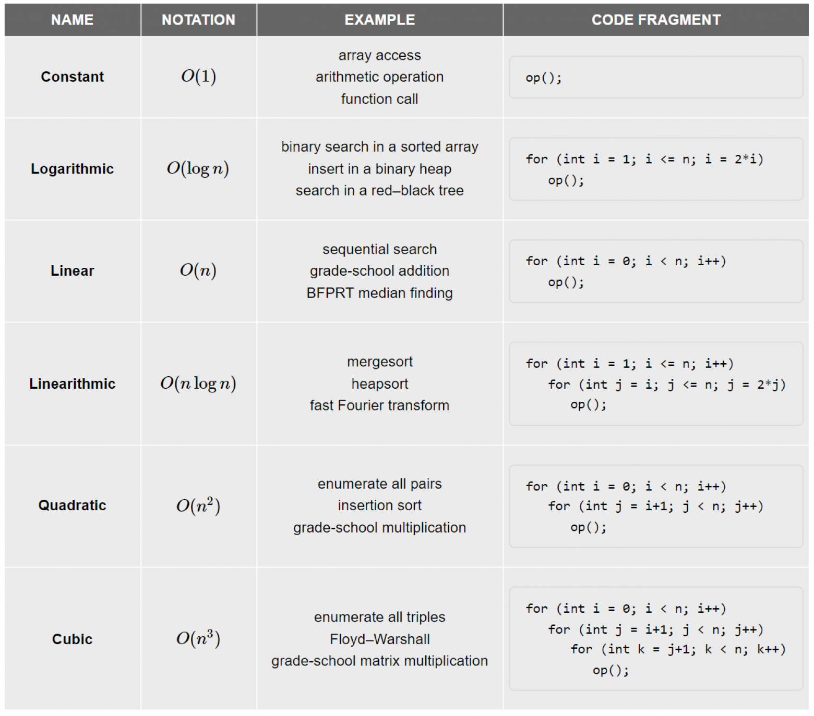
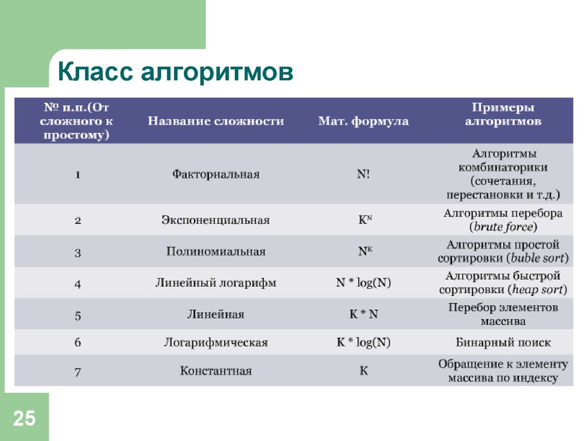
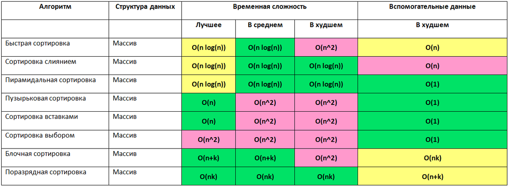
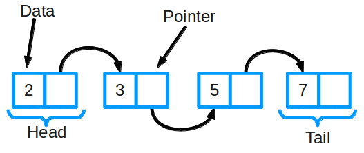
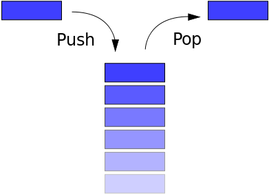
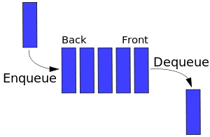
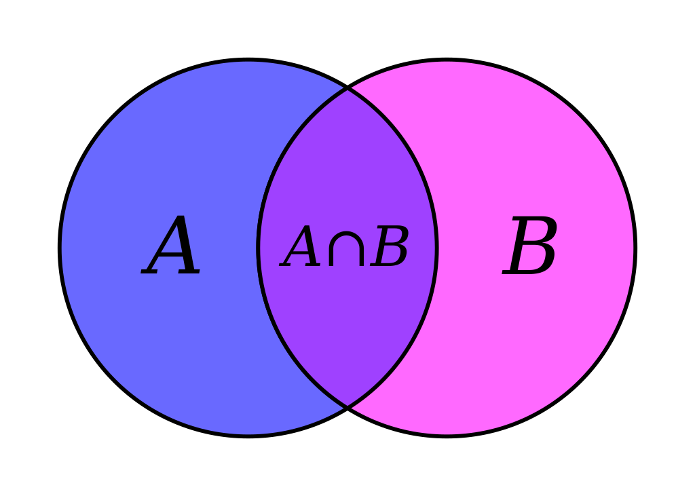
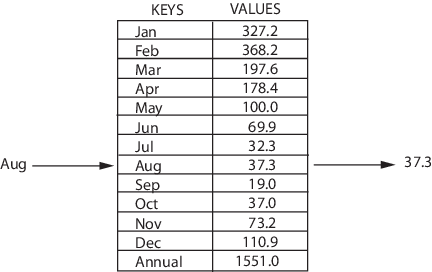

# Алгоритмы, структуры данных и сортировки
Асимптотическая сложность - (уточнить) количество операций от количества элементов.
Алгоритмиеская сложность - (уточнить) время выполнения или используемая память от количества элементов.

Полезные материалы:  
 - [Шпаргалка для алгособеса — алгоритмическая сложность, структуры данных, методы сортировки и Дейкстра](https://habr.com/ru/articles/794556/)

## Сложности (выше - легче)
Использование заглавной буквы О (О-нотация) пришло из математики, где её применяют для сравнения асимптотического поведения функций. Формально O(f(n)) означает, что время работы алгоритма (или объём занимаемой памяти) растёт в зависимости от объёма входных данных не быстрее, чем некоторая константа, умноженная на f(n).

### O(1) — константная сложность
Случается, что время работы алгоритма вообще не зависит от размера входных данных. Тогда сложность обозначают как O(1). Например, для определения значения третьего элемента массива не нужно ни запоминать элементы, ни проходить по ним сколько-то раз. Всегда нужно просто дождаться в потоке входных данных третий элемент и это будет результатом, на вычисление которого для любого количества данных нужно одно и то же время.

> Характерные примеры со сложностью O(1): арифметические операции, вызов функции

### O(log n) — логарифмическая сложность
Простейший пример — бинарный поиск. Если массив отсортирован, мы можем проверить, есть ли в нём какое-то конкретное значение, методом деления пополам. Проверим средний элемент, если он больше искомого, то отбросим вторую половину массива — там его точно нет. Если же меньше, то наоборот — отбросим начальную половину. И так будем продолжать делить пополам, в итоге проверим log n элементов.

### O(n) — линейная сложность
Такой сложностью обладает, например, алгоритм поиска наибольшего элемента в не отсортированном массиве. Нам придётся пройтись по всем n элементам массива, чтобы понять, какой из них максимальный.

### O(n^2) — квадратичная сложность
Такую сложность имеет, например, алгоритм сортировки вставками. В канонической реализации он представляет из себя два вложенных цикла: один, чтобы проходить по всему массиву, а второй, чтобы находить место очередному элементу в уже отсортированной части. Таким образом, количество операций будет зависеть от размера массива как n*n, т. е. n^2.

Примеры реализаций разных сложностей (python):



Сложности сортировок:


## Структуры данных

### Связный список



**Связный список** — одна из базовых структур данных. Ее часто сравнивают с массивом, так как многие другие структуры можно реализовать с помощью либо массива, либо связного списка.

В отличие от классического массива, где данные в памяти расположены строго последовательно, в **односвязном списке**, наоборот, данные расположены **хаотично** и связывание узлов списка происходит посредством **ссылок**. За счёт этой особенности в односвязный список можно добавлять произвольное число элементов, однако, доступ будет осуществляться только последовательно. Произвольного доступа к элементам в односвязном списке нет.

Также существуют **двусвязные списки**: в них у каждого узла есть указатель и на следующий, и на предыдущий элемент в списке. Есть ещё **кольцевой связный список** — у него хвост (последний узел) ссылается на голову (первый узел).

Связные списки могут быть использованы для реализации стека и очереди (здесь вместо связных списков можно использовать и массивы):

**Стек**  
Голова связного списка, лежащего в основе стека, единственное место для вставки и удаления элементов

**Очередь**  
Очередь представляет собой двусвязный список, в котором элементы удаляются из головы, а добавляются в хвост

| действие | сложность |
| -------- | -------- |
| поиск элемента   | O(n)   |
| добавление элемента   | O(1)   |
| удаление элемента   | O(n)   |
| подсчёт элементов, подходящих под условие   | O(n)   |

### Стек



**Стек** — базовая структура данных, которая позволяет добавлять или удалять элементы только в ее начале. Она похожа на стопку книг: если вы хотите взглянуть на книгу в середине стека, сперва придется убрать лежащие сверху. LIFO (Last In First Out, "последним пришел — первым вышел") 

Стоит отметить, что стек представляет собой список с элементами и указателя на вершину стека, указывающего на последний элемент, добавленный в стек.

Каждый раз, когда в стек добавляется новый элемент, указатель на вершину смещается на следующий элемент. Когда элемент удаляется из вершины стека, указатель смещается на предыдущий элемент. Если указатель находится в конце стека, то стек пуст.

| действие | сложность |
| -------- | -------- |
| добавление элемента в вершину стека (push)   | O(1)   |
| удаление элемента из вершины стека (pop)   | O(1)   |
| возврат верхнего элемента без его удаления (peek)   | O(1)   |
| проверка стека на пустоту (isEmpty)   | O(1)   |

### Очередь



Эту структуру можно представить как очередь в продуктовом магазине. Первым обслуживают того, кто пришел в самом начале — все как в жизни. (FIFO (First In First Out, "первый пришел — первый вышел"))

| Алгоритм | Среднее значение | Худший случай |
| -------- | -------- | -------- |
| Поиск   | O(n)   | O(n)   |
| Вставка   | O(1)   | O(1)   |
| Удаление   | O(1)   | O(1)   |

### Множество



**Множество** хранит значения данных без определенного порядка, не повторяя их (есть ещё мультимножество, там могут быть повторы).

Оно позволяет не только добавлять и удалять элементы: есть еще несколько важных функций, которые можно применять к двум множествам сразу:

- Объединение комбинирует все элементы из двух разных множеств, превращая их в одно (без дубликатов)
- Пересечение анализирует два множества и  создает еще одно из тех элементов, которые присутствуют в обоих изначальных множествах
- Разность выводит список элементов, которые есть в одном множестве, но отсутствуют в другом
- Подмножество выдает булево значение, которое показывает, включает ли одно множество все элементы другого множества

| действие | сложность |
| -------- | -------- |
| поиск элемента   | O(1)   |
| добавление элемента   | O(1)   |
| удаление элемента (для неупорядоченного множества)   | O(1)   |

### Map (словарь, ассоциативный массив)



**Map** — структура, которая хранит данные в парах ключ/значение, где каждый ключ уникален. Иногда ее также называют ассоциативным массивом или словарем. Map часто используют для быстрого поиска данных.

Нередко под капотом у Map хеш-таблица, поэтому можно рассматривать Map как обёртку над более общими хеш-таблицами.

| действие | сложность |
| -------- | -------- |
| добавление нового элемента с уникальным ключом   | O(1)   |
| удаление элемента по ключу   | O(1)   |
| изменение значения по ключу   | O(1)   |
| получение значения по ключу   | O(1)   |

### Хеш-таблица


**Хеш-таблица** — структура, которая содержит пары ключ/значение. Она использует хеш-функцию для вычисления индекса в массиве из блоков данных, чтобы найти желаемое значение. Хеш-таблицы часто используются для реализации Map (словарей).

<details>
<summary>Как работает</summary>

Обычно хеш-функция принимает строку символов в качестве вводных данных и выводит числовое значение. Для одного и того же ввода хеш-функция должна возвращать одинаковое число. Если два разных ввода хешируются одинаково, возникает коллизия. Коллизий нужно избегать, они приводят к тому, что разные элементы получают один и тот же адрес в памяти, что снижает производительность хеш-таблицы.

Когда вы вводите пару ключ/значение в хеш-таблицу, ключ проходит через хеш-функцию, функция возвращает число. В дальнейшем это число используется как фактический ключ, который соответствует определенному значению. Когда вы снова введете тот же ключ, хеш-функция обработает его и вернет такой же числовой результат. Затем этот результат будет использован для поиска связанного значения. Это позволяет мгновенно извлекать элементы с минимальной сложностью O(1).
</details>

| действие | сложность |
| -------- | -------- |
| добавление нового элемента с уникальным ключом   | O(1)   |
| удаление элемента по ключу   | O(1)   |
| изменение значения по ключу   | O(1)   |
| получение значения по ключу   | O(1)   |

### Двоичное (бинарное) дерево


**Дерево** — структура данных, состоящая из узлов. Ей присущи следующие свойства:

- Каждое дерево имеет корневой узел (вверху)
- Корневой узел имеет 0 или более дочерних узлов
- Каждый дочерний узел имеет 0 или более дочерних узлов, и т.д.

У двоичного дерева поиска есть 2 дополнительных свойства:

- Каждый узел имеет до 2 дочерних узлов (потомков)
- Каждый узел меньше своих потомков справа, а его потомки слева меньше его самого

Двоичные деревья поиска позволяют быстро находить, добавлять и удалять элементы. Они устроены так, что время каждой операции пропорционально логарифму общего числа элементов в дереве.

| Алгоритм | Среднее значение | Худший случай |
| -------- | -------- | -------- |
| Поиск   | O(log n)   | O(n)   |
| Вставка   | O(log n)   | O(n)   |
| Удаление   | O(log n)   | O(n)   |

### Префиксное дерево (бор)


// TODO https://habr.com/ru/articles/794556/

Сложности структур данных:


// TODO: Бинарный поиск
```php
<?php
function binarySearch(array $array, $target) {
    $leftIndex = 0;
    $rightIndex = count($array) - 1;
    
    while ($leftIndex <= $rightIndex) {
        $mid = (int)(($leftIndex + $rightIndex) / 2);
        
        // Check if target is present at mid
        if ($array[$mid] == $target) {
            return $mid;
        }
        
        // If target greater, ignore left half
        if ($array[$mid] < $target) {
            $leftIndex = $mid + 1;
        } else { // If target is smaller, ignore right half
            $rightIndex = $mid - 1;
        }
    }
    
    // Element is not present in array
    return -1;
}

// Пример использования
$target = 7;
$result = binarySearch([1, 3, 5, 7, 9, 11, 13], $target);

if ($result != -1) {
    echo "Элемент $target найден по индексу $result";
} else {
    echo "Элемент $target не найден в массиве";
}
```
```php
// С использованием рекурсии
function binarySearch(array $arr, string $searchTerm, int $left, int $right): int {
  if ($left > $right) {
    return -1;
  }

  $mid = floor(($left + $right) / 2);
  $comparison = strcmp($arr[$mid], $searchTerm);

  if ($comparison === 0) {
    return $mid;
  }

  if ($comparison > 0) {
    return binarySearch($arr, $searchTerm, $left, $mid - 1);
  } else {
    return binarySearch($arr, $searchTerm, $mid + 1, $right);
  }
}

```

// TODO: Быстрая сортировка
```php
function quickSort(array $array): array {
    $total = count($array);
    
    if ($total < 2) return $array;
    
    $pivot = $array[0];
    $left = [];
    $right = [];
    
    for ($i = 1; $i < $total; $i++) {
    	if ($array[$i] < $pivot) {
    		$left[] = $array[$i];
    	} else {
    		$right[] = $array[$i];
    	}
    }
    
    return array_merge(quickSort($left), [$pivot], quickSort($right));
}

// Пример использования
$array = [3, 6, 8, 10, 1, 2, 1];
$sortedArray = quickSort($array);
print_r($sortedArray);
```