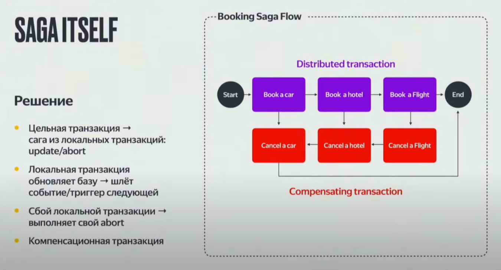
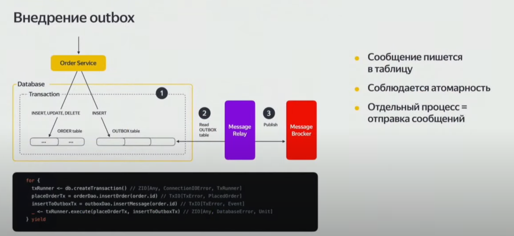

# Архитектурные паттерны

## SAGA (распределённые транзакции)

 На картинке Хореография

Подробнее о распределённых транзакциях [тут](https://youtu.be/P98oMiVCnq8?si=FUIuAZJp5xb7ZDq).

Saga предполагает выполнение длительной транзакции, которая разделена на ряд более мелких операций, каждая из которых управляется отдельным микросервисом. Если какая-то из этих операций не удаётся, то должны быть выполнены компенсационные операции для отката всей транзакции.

> Теряется изолированность из ACID, т.к. данные применённые в сервисе становятся автоматически видны (аналог READ_UNCOMMITED).

### Оркестрация
Оркестрация предполагает, что есть централизованный сервис (или несколько сервисов), который управляет выполнением операций и обрабатывает ошибки.

### Хореография
Хореография предполагает, что каждый микросервис сам определяет, какие операции следует выполнить дальше на основе сообщений, которые он получает.

## Outbox (распределённые транзакции)



Outbox Pattern - это паттерн, используемый в микросервисной архитектуре для гарантирования доставки сообщений между микросервисами. 

Outbox часто используется в связке с паттерном Saga, так как оба этих паттерна направлены на решение проблемы консистентности данных в микросервисной архитектуре. Outbox может использоваться для передачи сообщений о том, что определенная операция в Saga была выполнена или не удалась, и это может быть использовано для инициации следующей операции или для запуска компенсационных операций.

Решение заключается в том, чтобы служба, отправляющая сообщение (заказ), сначала сохраняла сообщение в базе данных как часть транзакции, обновляющей бизнес-объекты (смотреть изображение). Затем отдельный процесс отправляет сообщения брокеру сообщений.

> Может решать проблему упавшего брокера сообщений в saga паттерне

## SQRS
Aрхитектурный паттерн, который предлагает разделить операции чтения данных (запросы) и операции записи данных (команды) на разные уровни или компоненты системы.

```php
// Command
class CreateUserCommand {
    public $name;
    public $email;

    public function __construct($name, $email) {
        $this->name = $name;
        $this->email = $email;
    }
}

// Command Handler
class CreateUserHandler {
    public function handle(CreateUserCommand $command) {
        // Логика создания пользователя
        User::create(['name' => $command->name, 'email' => $command->email]);
    }
}

// Query
class GetUserQuery {
    public $userId;

    public function __construct($userId) {
        $this->userId = $userId;
    }
}

// Query Handler
class GetUserHandler {
    public function handle(GetUserQuery $query) {
        // Логика получения пользователя
        return User::find($query->userId);
    }
}

// CQRS Bus
class CQRSBus {
    protected $commandHandlers = [];
    protected $queryHandlers = [];

    public function registerCommandHandler($command, $handler) {
        $this->commandHandlers[$command] = $handler;
    }

    public function registerQueryHandler($query, $handler) {
        $this->queryHandlers[$query] = $handler;
    }

    public function dispatchCommand($command) {
        $handler = $this->commandHandlers[get_class($command)];
        $handler->handle($command);
    }

    public function dispatchQuery($query) {
        $handler = $this->queryHandlers[get_class($query)];
        return $handler->handle($query);
    }
}

// Пример использования
$cqrsBus = new CQRSBus();
$cqrsBus->registerCommandHandler(CreateUserCommand::class, new CreateUserHandler());
$cqrsBus->registerQueryHandler(GetUserQuery::class, new GetUserHandler());

$createCommand = new CreateUserCommand('John Doe', 'john@example.com');
$cqrsBus->dispatchCommand($createCommand);

$getUserQuery = new GetUserQuery(1);
$user = $cqrsBus->dispatchQuery($getUserQuery);
```

## Command Bus
Паттерн, использующийся для отделения бизнес-логики от её вызова.
- **Команда (Command)**: Объект, который содержит все данные, необходимые для выполнения действия. Команды часто являются простыми объектами без бизнес-логики.
- **Обработчик команд (Command Handler)**: Класс, который принимает команду и выполняет бизнес-логику.
- **Шина команд (Command Bus)**: Механизм доставки команд к соответствующим обработчикам.

```php
// Command
class CreateUserCommand {
    public $name;
    public $email;

    public function __construct($name, $email) {
        $this->name = $name;
        $this->email = $email;
    }
}

// Command Handler
class CreateUserHandler {
    public function handle(CreateUserCommand $command) {
        // Логика создания пользователя
        User::create(['name' => $command->name, 'email' => $command->email]);
    }
}

// Command Bus
class CommandBus {
    protected $handlers = [];

    public function registerHandler($command, $handler) {
        $this->handlers[$command] = $handler;
    }

    public function dispatch($command) {
        $handler = $this->handlers[get_class($command)];
        $handler->handle($command);
    }
}

// Пример использования
$commandBus = new CommandBus();
$commandBus->registerHandler(CreateUserCommand::class, new CreateUserHandler());

$command = new CreateUserCommand('John Doe', 'john@example.com');
$commandBus->dispatch($command);
```

# Паттерны проектирования

## Gateway
Cтруктурный паттерн проектирования, который используется для управления доступом к системе или внешним ресурсам через единый интерфейс.

## Singleton (одиночка)
Порождающий паттерн, гарантирующий что у класса будет только один экземпляр и предоставляющий глобальную точку доступа к нему.
```php
class HttpClient
{
    private static HttpClient $instance;

    // Приватный конструктор чтобы нельзя было инициализировать экземпляр класса
    private function __construct() {}

    // Статический метод чтобы вызвать без инициализации экземпляра класса
    public static function getInstance()
    {
        // Проверяем был ли содан инстанс
        if (empty(self::$instance)) {
            self::$instance = new HttpClient;
        }

        // Возвращаем новый или имеющийся инстанс
        return self::$instance;
    }

    // Методы доступные инстансу
    public function getProfile() {}
    public function updateProfile() {}
    public function getSomething() {}
}

HttpClient::getInstance()->getProfile();
```
> При каждом вызове getInstance мы будем получать один и тот же экземпляр класса HttpClient. Если добавить сеттеры, то его можно ещё и модифицировать для всех вызовов.

## Factory method (фабричнй метод/фабрика)
Порождающий паттерн, определяющий общий интерфейс для создания объектов в суперклассе.
```php
// Создаём абстракцию для класса реализующего логику создания комментария
abstract class CommentProducer
{
    abstract public function makeComment(): Comment;
}

// Класс реализующий логику создания комментария от лица пользователя
class UserCommentCreator extends CommentProducer
{
    public function makeComment(): Comment
    {
        return Comment::cretate([...]);
    }
}

// Класс реализующий логику создания комментария от лица канала
class ChannelCommentCreator extends CommentProducer
{
    public function makeComment(): Comment
    {
        return Comment::cretate([...]);
    }
}

// Фабрика, инициализирующя экземпляр создателя комментария на основе строки (например маршрута)
class CommentProducerFactory
{
    public const string USER = 'user';
    public const string CHANNEL = 'channel';

    public function __construct(public readonly string $producerName) {}

    public function getProducer()
    {
        return match ($this->producerName) {
            self::USER => new UserCommentCreator,
            self::CHANNEL => new ChannelCommentCreator,
        };
    }
}

// Инициализация
$commentProducerFactory = new CommentProducerFactory(CommentProducerFactory::USER);
$comment = $commentProducerFactory->getProducer()->makeComment();
```

## Abstract factory (абстрактная фабрика)
Порождающий паттерн, позволяющий создавать семейства свзяанных объектов
```php
// Обозначаем набор (семейство) элементов интерьера. Здесь интерьер из 2 элементов 
interface TwoLayerInterior
{
    public function getTable(): Table;
    public function getSofa(): Sofa;
}

// Интерьеру в каждом стиле присваиваем интерфейс набора. Фабрика конечных объектов
class ClassicInteriorFactory implements TwoLayerInterior
{
    public function getTable(): Table
    {
        return new ClassicTable();
    }

    public function getSofa(): Sofa
    {
        return new ClassicSofa();
    }
}

class ArtDecoInteriorFactory implements TwoLayerInterior
{
    public function getTable(): Table
    {
        return new ArtDecoTable();
    }

    public function getSofa(): Sofa
    {
        return new ArtDecoSofa();
    }
}

// Обозначаем каждый элемент интерьера
interface Table
{
    public function getName(): string;
    public function getHeight(): int;
    public function getWidth(): int;
}

interface Sofa
{
    public function getName(): string;
    public function getColor(): string;
}

// Описываем каждый элемент интерьера для каждого стиля
class ClassicTable implements Table
{
    public function getName(): string
    {
    	return 'Classic table';
    }
    
    public function getHeight(): int
    {
        return '100';
    }

    public function getWidth(): int
    {
        return '250';
    }
}

class ArtDecoTable implements Table
{
    public function getName(): string
    {
    	return 'Art-deco table';
    }
    
    public function getHeight(): int
    {
        return '500';
    }

    public function getWidth(): int
    {
        return '1000';
    }
}

class ClassicSofa implements Sofa
{
    public function getName(): string
    {
    	return 'Classic sofa';
    }
    
    public function getColor(): string
    {
        return 'red';
    }
}

class ArtDecoSofa implements Sofa
{
    public function getName(): string
    {
    	return 'Art-deco sofa';
    }
    
    public function getColor(): string
    {
        return 'blue';
    }
}

function getTwoLayerInterior(TwoLayerInterior $interior)
{
    $table = $interior->getTable();
    $sofa = $interior->getSofa();

    echo $table->getName() . "\n";
    echo $table->getHeight() . "\n";
    echo $table->getWidth() . "\n";
    
    echo $sofa->getName() . "\n";
    echo $sofa->getColor() . "\n";
}

// Получаем набор предметов интерьера в классическом стиле
getTwoLayerInterior(new ClassicInteriorFactory());

// Получаем набор предметов интерьера в стиле арт-деко
getTwoLayerInterior(new ArtDecoInteriorFactory());
```

## Prototype (прототип)
Порождающий паттерн, позволяющий клонировать объекты любой сложности без привязки к их конкретным классам

```php
class Author
{
    public array $publications = [];

    public function __construct(public string $name)
    {
    }

    public function addPublication(Publication $publication)
    {
        $this->publications[] = $publication;
    }
}

class Publication
{
    public string $title;
    public Author $author;
    public array $comments = [];

    public function __construct(public string $title, public Author $author)
    {
        $this->author->addPublication($this);
    }

    public function addComment(string $comment)
    {
        $this->comments[] = $comment;
    }

    public function __clone()
    {
        $this->title = 'Clone of ' . $this->title;
        foreach ($this->comments as $comment) {
            $this->addComment($comment);
        }
        $this->author = clone $this->author;
        $this->author->addPublication($this);
    }
}

$author = new Author('Sergey');
$p1 = new Publication('title', $author);
$p2 = clone $p1;

// Только одна публикация, т.к. автора клонировали
var_dump($p1->author->publications);
// Обе публикации, т.к. добавили в клонированную
var_dump($p2->author->publications);
// false т.к. разные инстансы
var_dump($p1->author === $p2->author);
```