# PHP

### Типы данных
 - boolean
 - integer
 - float
 - string
 - null
 - array
 - object
 - resource
 - callable
 - iterable

### Операторы
1. **=** Обычный оператор присваивания, который присваивает значение справа от него переменной слева от него.
2. **+=** Оператор присваивания суммы. Он добавляет значение справа к значению переменной слева и присваивает результат переменной слева.
3. **-=** Оператор присваивания разности. Вычитает значение справа из значения переменной слева и присваивает результат переменной слева.
4. ***=** Оператор присваивания произведения. Умножает значение переменной слева на значение справа и присваивает результат переменной слева.
5. **/=** Оператор присваивания частного. Делит значение переменной слева на значение справа и присваивает результат переменной слева.
6. **%=** Оператор присваивания остатка от деления. Производит деление значения переменной слева на значение справа и присваивает остаток переменной слева.
7. **.=** Оператор присваивания конкатенации. Присоединяет строку справа к строке переменной слева и присваивает результат переменной слева.
8. **<<=** Оператор присваивания сдвига влево. Сдвигает биты значения переменной слева влево на количество бит, указанное значением справа, и присваивает результат переменной слева.
9. **>>=** Оператор присваивания сдвига вправо. Сдвигает биты значения переменной слева вправо на количество бит, указанное значением справа, и присваивает результат переменной слева.
10. **<=>** Оператор комбинированного сравнение "spaceship". Возвращает 0 если значение эквивалентны, возвращает 1 если значение слева больше, возвращает -1 если значение справа больше.

### Операторы объединения Null
1. **??** Этот оператор возвращает левый операнд, если он существует и не является null, иначе возвращает правый операнд. Он полезен, когда нужно выбрать первое значение, которое не является null из нескольких вариантов. Синтаксис: ```$result = $value ?? $default;```
2. **??=** Этот оператор присваивания по null-объединению используется для присвоения значения переменной только в том случае, если переменная не имеет значения или имеет значение null. Синтаксис: ```$variable ??= $value;```

### Тернарный оператор
1. **?:** Этот оператор позволяет использовать условное выражение для присвоения значения переменной в зависимости от выполнения условия. Синтаксис: условие ? выражение1 : выражение2. Если условие истинно, то присваивается значение выражения 1, в противном случае - значение выражения 2.

### Сравнение объектов
1. **==** - Равны если объекты являются экземплярами одного класса и их свойства и значения равны
2. **===** - Равны только когда оба ссылаются на один и тот же экземпляр одного и того же класса. Например $u1 = new User(); $u2 = $u1; echo $u1 === $u2; // true

### JIT
    PHP JIT (Just-In-Time) — это компилятор, который компилирует PHP-код в машинный код во время выполнения, что позволяет значительно ускорить выполнение скриптов. 

Это достигается за счёт оптимизации кода на более низком уровне, чем это возможно при интерпретации кода.  
JIT доступен с PHP 8 как расширение Opcache.

## Что нового в PHP

> Обновления всегда можно найти здесь (поменять версию)
> https://www.php.net/releases/8.3/ru.php

### PHP 8.0
 - Именованные параметры (т.е. arg_name: value Вместо заполнения предыдущих аргументов по умолчанию)
 - Атрибуты (вместо комментариев к DocBlock)
 - Объявление свойств в конструкторе (свойства в конструкторе вместо обычного объявления)
 - Тип Union (т.е. `int|string` $varname)
 - Выражение Match (чтобы заменить некоторые из switch-case)
 - Оператор Nullsafe (вместо nesteds ifs)
 - Улучшенное сравнение строк и чисел (т.е. `0 == 'somestrval'` // not true anymore)
 - Ошибки согласованности типов для встроенных функций (теперь внутренние функции генерируют типизированные исключения)
 - Компиляция Just-In-Time (JIT) (2-кратная производительность в некоторых конкретных долго работающих приложениях)

### PHP 8.1
 - Перечисления (enums)
 - Свойства только для чтения (для VO и DTO)
 - Callback-функции как объекты первого класса (для получения ссылки на любую функцию, т.е. `$fn = strlen(...);`)
 - Пересечение входящих типов (function countAndIterate(`Commentable & Model` $value) {})
 - Тип возвращаемого значения never (чтобы было понятно, что функция ничего не возвращает)
 - Final константы (не могут переопределять функции и наследовать классы)
 - Явное восьмеричное числовое обозначение
 - Fibers
 - Поддержка распаковки массивов со строковыми ключами ($result = ['a' => 0, `...$arrayA`, `...$arrayB`];)

### PHP 8.2
 - Readonly-классы
 - Типы в виде дизъюнктивной нормальной формы (ДНФ) (public function bar(`(A&B)|null` $entity) {})
 - Самостоятельные типы null, false и true
 - Новый модуль "Random"
 - Константы в трейтах
 - Динамические свойства объявлены устаревшими

### PHP 8.3
 - Типизированные константы классов
 - Динамическое получение констант класса (var_dump(Foo::`{$searchableConstant}`);)
 - Новый атрибут #[\Override]
 - Глубокое клонирование readonly-свойств (readonly cвойства теперь могут быть изменены один раз с помощью магического метода __clone)
 - Новая функция json_validate()
 - Новый метод Randomizer::getBytesFromString()
 - Новые методы Randomizer::getFloat() и Randomizer::nextFloat()
 - Линтер командной строки теперь принимает несколько имён файлов для проверки.

### Стандарты PSR (PHP Standards Recommendations)
    PSR — это набор стандартов, которые направлены на улучшение совместимости между различными фреймворками и библиотеками в экосистеме PHP.

Полная информация о PSR [тут](https://habr.com/ru/articles/458484/).

#### Автозагрузка
1. PSR-0 (устарел)/**PSR-4** — Autoloading Standard  
Автозагрузка файлов. Реализуется через Composer или spl_autoload_register()

#### Интерфейсы
1. **PSR-3**: Logger Interface  
Стандарт логгирования. Сейчас нет нужды реализовывать, т.к. есть Monolog.  
    <details>
    <summary>Уровни логгирования</summary>

    - **emergency** - катастрофические ошибки, которые делают приложение полностью непригодным для использования и могут потребовать перезагрузки или восстановления системы.
    - **alert** - неотложные ошибки, которые требуют вмешательства человека и могут повлиять на другие системы или службы, зависящие от приложения.  
    - **critical** - серьёзные ошибки, которые требуют немедленного внимания и могут привести к сбою приложения или сделать его недоступным.  
    - **error** - фактические ошибки, мешающие приложению выполнять намеченную задачу.  
    - **warning** - потенциальные проблемы, которые могут повлиять на функциональность или производительность приложения, но не являются критическими или фатальными.  
    - **notice** - важная информация, не являющаяся ошибкой, но которая может потребовать внимания.  
    - **info** - общая информация, которая полезна для понимания нормального потока приложения.   
    - **debug** - подробная информация, полезная при отладочных целях.
    </details>  
2. **PSR-6**: Caching Interface  
Интерфейс кеширования.
    <details>
    <summary>CacheItemInterface и CacheItemPoolInterface</summary>

    ```php
    interface CacheItemInterface
    {
        public function getKey();
        public function get();
        public function isHit();
        public function set($value);
        public function expiresAt($expiration);
        public function expiresAfter($time);
    }
    ```

    ```php
    interface CacheItemPoolInterface
    {
        public function getItem($key);
        public function getItems(array $keys = array());
        public function hasItem($key);
        public function clear();
        public function deleteItem($key);
        public function deleteItems(array $keys);
        public function save(CacheItemInterface $item);
        public function saveDeferred(CacheItemInterface $item);
        public function commit();
    }
    ```
    </details>
3. **PSR-11**: Container Interface  
Интерфейс реализации DI-контейнера. Спецификация не описывает то, как необходимо регистрировать зависимости в проекте, однако дает четкую рекомендацию как делать не нужно.
4. **PSR-13**: Hypermedia Links  
Предоставляет несколько интерфейсов, чтобы унифицировать общий формат hypermedia ссылок.
5. **PSR-14**: Event Dispatcher  
Целью этого PSR является создание общего механизма для диспетчеризации событий, чтобы библиотеки и компоненты могли свободно использоваться в различных приложениях и средах.
6. **PSR-16**: Simple Cache  
Упрощённая версия PSR-6, т.к. он может быть избыточным. Этот более простой подход направлен на создание стандартизированного оптимизированного интерфейса для общих случаев.
    <details>
    <summary>CacheInterface</summary>

    ```php
    interface CacheInterface
    {
        public function get($key, $default = null);
        public function set($key, $value, $ttl = null);
        public function delete($key);
        public function clear();
        public function getMultiple($keys, $default = null);
        public function setMultiple($values, $ttl = null);
        public function deleteMultiple($keys);
        public function has($key);
    }
    ```
    </details>

#### HTTP
1. **PSR-7**: HTTP Message Interfaces  
Цель данного стандарта, предоставить общий набор интерфейсов для фреймворков, чтобы последние могли использовать одинаковые абстракции над Request и Response объектами.
2. **PSR-15**: HTTP Handlers  
Спецификация данного стандарта описывает интерфейсы для обработчиков HTTP-запросов
и компонентов промежуточного программного обеспечения HTTP-сервера. Если не вдаваться во все тонкости, то по сути это возможность писать некие абстрактные контроллеры для последующего переиспользования между различными проектами.
3. **PSR-17**: HTTP Factories  
Общий стандарт для фабрик, которые создают HTTP-объекты, совместимые с PSR-7.
4. **PSR-18**: HTTP Client  
Описывает общие интерфейсы для отправки PSR-7 HTTP-запросов и получения HTTP-ответов.

#### Стиль кодирования

1. **PSR-1**: Basic Coding Standard
    <details>
    <summary>Базовые спецификации</summary>

    - Использование только тэгов <?php и <?=
    - Только UTF-8 без BOM для php кода
    - Не стоит мешать разный функционал в одном файле (1 файл = 1 класс)
    - Пространство имен и классы должны следовать [PSR-0, PSR-4]
    - Классы объявляются в `StudlyCase`
    - Константы объявляются в ТАКОМ_ВИДЕ
    - Методы объявляются в `camelCase`
    </details>
2. PSR-2 (устарел)/**PSR-12**: Extended Coding Style Guide

### Принипы ООП
**Наследование** - Классы могут наследоваться друг от друга  
**Инкапсуляция** - Сокрытие данных и функциональных возможностей от клиентского кода  
**Полиморфизм** - Поддержка нескольких реализаций на основе общего интерфейса

### Статические классы/методы/свойства
Статические классы и свойства в PHP имеют ряд преимуществ перед обычными (нестатическими) в определённых сценариях.  
Вот их ключевые особенности и плюсы:
- **Доступ без создания экземпляра**  
  Статические свойства и методы принадлежат классу, а не объекту. Это позволяет использовать их без создания экземпляра класса
- **Общее состояние для всех экземпляров**  
  Данные, хранящиеся в статических свойствах, разделяются между всеми экземплярами класса. Т.е. записав данные в статическое свойство единожды, данные будут доступны в неизменённом (если не менять целенаправленно) виде из других вызовов этого класса.
- **Удобство для вспомогательных методов**  
  Статические методы часто используются для утилитарных функций , которые не зависят от состояния объекта
- **Экономия ресурсов**  
  Если метод не требует доступа к данным экземпляра, объявление его как `static` позволяет избежать создания лишних объектов, что улучшает производительность в некоторых случаях.
- **Реализация Singleton и мемоизации**
  Статические свойства и методы используются для реализации паттерна Singleton и мемоизации.

### Анонимные функции (лямбда-функции)
    Анонимные функция - функция, не имеющая имени, которую можно использовать как значения (может быть объектом Closure, но без захвата переменных из внешнего контекста). Это позволяет передавать функции в качестве аргументов другим функциям или возвращать их из функций.

<details>
<summary>Реализация</summary>

```php
$greet = function ($name) {
    return "Hello, $name!";
};

echo $greet("Alice"); // Вывод: Hello, Alice!
```
</details>

### Замыкания (closure)
    Замыкание - это анонимная функция, способная сохранять значения из внешнего контекста, в котором она была создана (ключевое слово use). Это полезный механизм, который позволяет создавать функции на лету и передавать их в качестве параметров, сохраняя при этом контекст, в котором они были созданы.

> Если анонимная функция имеет use, она автоматически является замыканием. А если у неё есть use и нет имени, то она является и анонимной функцией и замыканием одновременно.

```php
$greet = function () use ($userType) {
    return "Hello user! You are $userType";
};

echo $greet();
```

> Если анонимная функция определена внутри метода класса, то `$this` автоматически доступно внутри замыкания:

<details>
<summary>Реализация</summary>

```php
class Example {
    private $value = 42;

    public function getValue() {
        $closure = function () {
            return $this->value; // $this доступен автоматически
        };
        return $closure();
    }
}

$example = new Example();
echo $example->getValue(); // Вывод: 42
```
</details>
<br>

> Если используется <ins>**статическое замыкание**</ins>, или замыкание используется в <ins>**статическом методе**</ins>, то `$this` нужно передавать явно через `use`:

<details>
<summary>Реализация</summary>

```php
class Example {
	public $value = 42;
	
    public function getValue() {
        $obj = $this;
        $closure = static function() use ($obj) { // статическое замыкание
            return $obj->value;
        };
        return $closure();
    }
}

$example = new Example();
echo $example->getValue(); // Выведет: 42
```
</details>

### Функции высшего порядка
    Функции высшего порядка — это функции, которые принимают другие функции в качестве аргументов или возвращают их в качестве результата.

<details>
<summary>Реализация</summary>

```php
$squared = array_map(function ($x) {
    return $x * $x;
}, [1, 2, 3, 4]);

print_r($squared); // Вывод: [1, 4, 9, 16]
```
</details>

### Чистые функции
    Чистые функции - функции, выполняющиеся без побочных эффектов и всегда возвращающие одинаковый результат при одинаковых входных данных. Это означает, что они не зависят от состояния программы вне своих аргументов.

<details>
<summary>Реализация</summary>

```php
function add($a, $b) {
    return $a + $b;
}
```
</details>
<br>

Характеристики:
 - **!!! (выучить вместе с идемпотентностью) Детерминированность** - Результат выполнения функции определяется только её входными данными. То есть, при одинаковых входных данных функция всегда вернёт один и тот же результат.
 - **Отсутствие побочных эффектов** - Функция не вносит изменений во внешние данные или состояние программы. Она не изменяет глобальные переменные, не взаимодействует с файловой системой, не делает запросы к базе данных и т.д.

### Мемоизация
    Оптимизационная техника, используемая для ускорения работы программы путем кэширования результатов выполнения функций и повторного использования их при последующих вызовах с теми же входными данными

<details>
<summary>Реализация</summary>

```php
function memoizedFunction($input) {
    static $cache = [];

    if (! isset($cache[$input])) {
        // Выполняем вычисление только в случае, если результат еще не сохранен
        $cache[$input] = $input * $input;
    }

    return $cache[$input];
}
```
</details>

### SPL
    SPL - Набор интерфейсов, классов и функций, предназначенных для решения стандартных задач.

Интерфейсы SPL:
- **Iterator**: Позволяет объекту быть итерируемым (например, в цикле foreach).
- **ArrayAccess**: Позволяет объекту вести себя как массив.
- **Countable**: Позволяет объекту поддерживать функцию count().
- **Serializable**: Предоставляет возможность сериализации объекта.
- **Traversable**: Базовый интерфейс для всех итерируемых объектов (определяет, доступен ли обход класса конструкцией `foreach()`).

### Рефлексия
    Рефлексия — это механизм, позволяющий получить информацию о классах, интерфейсах, функциях, методах, свойствах и других элементах программы, а также выполнять с ними различные операции.

Используется в реализации Dependency Injection (DI) для автоматического разрешения зависимостей в Laravel. Также позволяет получить доступ к приватным свойствам и методам класса, что может помочь в тестировании или отладке, а также при работе с устаревшим кодом, где невозможно изменить видимость свойств и методов, чтобы взаимодействовать с ними.

> Рефлексия - один из методов переназначить приватным свойствам и методам значения. Вторым таким способом является механизм изменения контекста выполнения замыкания ``Closure::bind()``

### Магические методы
    Магические методы предоставляют возможность переопределить или дополнить поведение объектов и классов в различных ситуациях.

Часто используемые магические методы:
1. **__construct()**  
  Вызывается при создании нового объекта (конструктор).
2. **__destruct()**  
  Вызывается, когда объект уничтожается при завершении скрипта или удалении ссылки на объект (для освобождения ресурсов, закрытия файлов, соединений с базой данных).
3. **__get($name)**  
  Вызывается при попытке получить доступ к несуществующему или недоступному свойству объекта. (Может быть использован для реализации функциональности, похожей на кастеры (casters) в Laravel или выводить кастомную ошибку)
4. **__set($name, $value)**  
  Вызывается при попытке установить значение для несуществующего или недоступного свойства. (Может быть использован для реализации функциональности, похожей на кастеры (casters) в Laravel)
5. **__toString()**  
  Вызывается при попытке преобразовать объект в строку (например, с помощью echo).
6. **__clone()**  
  Вызывается при клонировании объекта с помощью ключевого слова clone.
7. **__call($name, $arguments) / __callStatic($name, $arguments)**  
  Вызывается при попытке вызвать несуществующий или недоступный метод объекта (__callStatic для статических).
8. **__invoke()**  
  Вызывается, если объект используется как функция (например, $obj()).
    <details>
    <summary>Реализация</summary>

    ```php
    class MyClass {
        public function __invoke($value) {
            echo "Invoked with value: $value\n";
        }
    }

    $obj = new MyClass();
    $obj(42); // Вывод: Invoked with value: 42
    ```
    </details>
    

### Раннее и позднее статическое связывание
    Раннее и позднее статическое связывание - это два способа, которыми PHP определяет, какой метод класса вызывать в случае, когда он переопределён в наследнике.

**Раннее статическое связывание**  
Когда метод вызывается через ключевое слово `self::`. Это означает, что PHP будет использовать метод из того же класса, где он был вызван, а не из класса, объект которого фактически был создан. Определение используемого класса происходит на этапе компиляции (т.е. до выполнения).  
**Позднее статическое связывание**  
Когда метод вызывается через ключевое слово `static::`. Оно ссылается на класс, который был использован для вызова метода, а не на класс, где метод был определен. Определение используемого класса происходит в рантайме (во время выполнения программы). 

> Если простыми словами, то чаще всего используется для получения доступа к константам и методам дочернего класса <ins>из родительского</ins>. Удобно для реализации логики в абстрактных классах. 

<details>
<summary>Реализация</summary>

```php
abstract class ParentClass {
    abstract protected static function getGreeting();

    public static function sayHello() {
        return static::getGreeting();
    }
}

class ChildClass extends ParentClass {
    protected static function getGreeting() {
        return 'Hello from Child Class!';
    }
}

class SecondLevelChild extends ChildClass {
    protected static function getGreeting() {
        return 'Hello from Second level!';
    }
}

echo Child::sayHello(); // Вывод: Hello from Child Class!
echo SecondLevelChild::sayHello(); // Вывод: Hello from Second level!
```
</details>

### Генераторы
  Генератор — высокоуровневая абстракция, упрощающая создание итераторов и экономящая ресурсы.

Генераторы нужны для перебора больших объёмов данных без выгрузки всех данных в память. Под капотом реализует интерфейс `Iterator` с автоматическим управлением состояния (автоматической итерацией). Ключевое слово `yield`, возвращающее результат текущей итерации. 

Генератор сохраняет своё состояние между вызовами `yield`. Это достигается за счет стека вызовов (не может быть переполнен генератором) и внутренней структуры данных, которая хранит: текущую позицию в последовательности, локальные переменные функции (включая переменные из замыкания), контекст выполнения.

<details>
<summary>Реализация генератора</summary>

```php
function getLines($file) {
    $f = fopen($file, 'r');
    try {
        while ($line = fgets($f)) {
            yield $line;
        }
    } finally {
        fclose($f);
    }
}

foreach (getLines("file.txt") as $n => $line) {
    if ($n > 5) break;
    echo $line;
}
```
</details>

> Генераторы умеют возвращать значения по ссылке: `foreach (getLines("file.txt") as &$line) {}`

#### Отличия от итератора
В генераторе уже реализован интерфейс `Iterator`, поэтому не нужно описывать дополнительные функции. Однако генераторы — однонаправленные итераторы и их <ins>нельзя перемотать назад</ins> после начала итерации. Это также означает, что один и тот же генератор нельзя повторять несколько раз: генератор необходимо пересоздавать каждый раз, снова вызвав функцию генератора.

### Copy-on-Write (COW)
Идея заключается в том, что при копировании данных (например, переменных или массивов) фактическое копирование не происходит сразу. Вместо этого обе переменные ссылаются на одни и те же данные в памяти до тех пор, пока одна из них не будет изменена. Только в момент изменения создается реальная копия данных.

<details>
<summary>Наглядный пример</summary>

```php
$a = [1, 2, 3]; // Создаем массив
$b = $a;        // "Копируем" массив

// На этом этапе $a и $b ссылаются на одни и те же данные в памяти и являются по сути одним и тем же массивом, а не двумя копиями

$b[0] = 10;     // Меняем значение в массиве $b

// Теперь PHP создает реальную копию данных для $b, так как произошло изменение
```
</details>
</br>

Не смотря на то, что всё кроме объектов передаётся в функции `по значению` (а значит создаётся копия, а не изменяется оригинал), механизм copy-on-write создаёт копию только в моменте изменения данных, а значит даже чтение циклом, в другой функции, произойдёт непосредственно из оригинала, пока данные не будут изменены. Объекты же передаются в функции `по ссылке`, а значит чтобы создать его копию, нужно его клонировать.

> Если данные слишком большие, PHP может быть вынужден создавать копию немедленно, чтобы избежать проблем с производительностью.

### Zval (Zend Value)
    Zval - это фундаментальная структура данных в PHP, которая используется для хранения значений переменных

Под капотом каждая переменная в PHP представляет собой структуру данных, которая содержит информацию о типе, значении и ссылках на другие данные.

**Основные элементы zval:**  
- **Тип данных**: Определяет тип значения переменной (например, целое число, строка, массив, объект и т.д.).  
- **Значение**: Само значение переменной.  
- **Счетчик ссылок (refcount)**: Отслеживает, сколько переменных ссылаются на этот zval.  
- **Флаги**: Дополнительные метаданные, такие как флаги для управления памятью или оптимизации.

<details>
<summary>Пример zval структуры</summary>

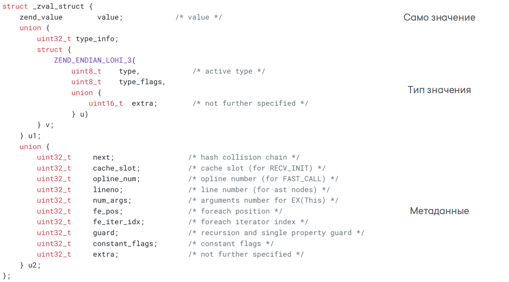
</details>

<details>
<summary>Пример работы на php</summary>

```php
$a = 42;       // Создаем переменную $a с целым числом.
$b = $a;       // Присваиваем значение $a переменной $b.
$b = 100;      // Меняем значение $b.
```

1. Когда вы создаете `$a = 42`, PHP создает `zval` со значением `42` и типом `IS_LONG`. Счетчик ссылок (refcount) равен `1`.
2. Когда вы делаете `$b = $a`, PHP не копирует значение, а просто увеличивает счетчик ссылок до `2`. Теперь обе переменные ссылаются на один и тот же `zval`.
3. Когда вы меняете значение `$b = 100`, PHP создает новый `zval` для `$b` со значением `100` и типом `IS_LONG`. Счетчик ссылок для старого значения (`42`) уменьшается до `1`.
</details>

### Сборщик мусора (Garbage collector)
    Сборщик мусора (Garbage Collector, GC) — это механизм в PHP, который автоматически освобождает память, занятую объектами или данными, которые больше не используются в программе.

Когда вы создаете переменные, объекты или массивы в PHP, они занимают память. Если вы перестаете использовать эти данные (например, присваиваете переменной новое значение или выходите из функции), то эта память должна быть освобождена, чтобы её можно было использовать для других данных. Если этого не делать, память будет заполняться "мусором", что может привести к замедлению программы или даже сбоям.

PHP сам управляет памятью через механизм счетчиков ссылок и сборщика мусора, чтобы разработчику не приходилось вручную освобождать память.

**Как работает сборщик мусора**:  
1. **Счетчики ссылок**  
  PHP использует механизм счетчиков ссылок (`refcount`), чтобы отслеживать, сколько переменных ссылаются на одно и то же значение.  
  Когда счетчик ссылок становится равным 0, PHP понимает, что объект больше не используется, и освобождает память.
2. **Проблема циклических ссылок**  
  Cчетчики ссылок не всегда могут полностью очистить память. Возникает проблема, если объекты ссылаются друг на друга, но больше не используются в программе. Это называется циклическая ссылка.

    Чтобы решить проблему циклических ссылок, PHP использует специальный сборщик мусора. Он периодически проверяет все объекты и определяет, какие из них больше не доступны в программе.  
  
    **Как это работает**:  
    - PHP отслеживает объекты, у которых есть циклические ссылки.
    - Сборщик мусора проходит по всем таким объектам и строит граф связей между ними.
    - Если объект недоступен (то есть на него никто не ссылается из "живых" частей программы), он помечается как "мусор".
    - Память, занятая этими объектами, освобождается.

    <details>
    <summary>Как выглядят циклические ссылки</summary>

    ```php
    class Test {
        public $link;
    }

    $a = new Test();
    $b = new Test();

    $a->link = $b; // $a ссылается на $b
    $b->link = $a; // $b ссылается на $a

    unset($a);
    unset($b);
    ```
    **Здесь**:  
    Объекты `$a` и `$b` ссылаются друг на друга.
    Когда вы удаляете `$a` и `$b`, счетчики ссылок не становятся равными 0, потому что объекты всё ещё ссылаются друг на друга.  
    В результате память, занятая этими объектами, не освобождается.
    </details> 

> Сборщик мусора всегда включён, но его можно временно отключить используя `gc_disable()` и потом включить `gc_enable()`.  
> Можно вызвать сборщик мусора вручную с помощью `gc_collect_cycles()`. Это полезно, если необходимо немедленно очистить память.  
> Сборщик мусора запускается автоматически когда количество "подозрительных" объектов (с циклическими ссылками) достигает определенного порога (по умолчанию 100). Этот порог можно изменить через настройку `zend_gc_threshold` в конфигурации PHP.

### Стек вызовов (call stack)
    В PHP, как и в других языках программирования, стек (абстрактная структура данных, которая работает по принципу LIFO (последним пришел — первым вышел)) играет ключевую роль в управлении вызовами функций. Каждый раз, когда вызывается функция, создается новый фрейм стека (stack frame). Этот фрейм содержит: аргументы функции, локальные переменные, информацию о том, куда вернуться после завершения функции.

Пример работы стека на примере рекурсии:  
Рекурсия — это процесс, при котором функция вызывает саму себя. Каждый рекурсивный вызов создает новый фрейм стека

<details>
<summary>Пример стека с рекурсией</summary>

```php
function factorial($n) {
    if ($n === 0) {
        return 1;
    }
    return $n * factorial($n - 1);
}

echo factorial(5); // Вывод: 120
```

**Как работает стек из примера**:  
1. Вызывается `factorial(5)`. Создается фрейм стека для каждой итерации (каждая новая операция лежит сверху):  
    ```
    Stack:
    factorial(4)
    factorial(5)
    ```
2. Стек заполняется операциями. Условие `if ($n === 0)` выполняется, и `factorial(0)` возвращает `1`. Фрейм `factorial(0)` удаляется из стека (первый уходит сверху, нижний последний): 
    ```
    Stack:
    factorial(0)
    factorial(1)
    factorial(2)
    factorial(3)
    factorial(4)
    factorial(5)
    ```
3. Вычисляется результат для каждой итерации `$n * factorial($n - 1)`, где `factorial($n - 1)` уже известное значение, и происходит удаление фрейма из стека, пока он не опустеет:  
    ```
    Stack:
    factorial(3)
    factorial(4)
    factorial(5)
    ```
</details>
</br>

> При большом размере стека он может переполниться (Stack Overflow) и приложение упадёт по памяти!

Чтобы избежать переполнения стека, можно использовать следующие подходы:
1. Использование итеративного подхода (цикла) вместо рекурсии
2. Ограничение глубины рекурсии
3. Увеличение лимита памяти `ini_set('memory_limit', '256M');`

> В PHP реально работают только перечисленные варианты, но в некоторых других языках есть термин "Хвостовая рекурсия (Tail Recursion)", смысл которой в дополнительном параметре функции, в который рекурсивно передаётся результат выполненной на текущий момент операции и благодаря которому оптимизатор не видит смысла возвращаться в предыдущий фрейм стека, т.к. там больше нет операций для выполнения.

### Принципы SOLID
**S** - *Принцип единой ответственности.* Один класс должен решать только одну задачу. `Модуль должен быть ответственен перед одним и только одним актором, и должна быть только одна причина для изменения.` Термин «актор» относится к группе (состоящей из одного или нескольких заинтересованных сторон или пользователей), которая требует изменения модуля. Например метод валидации в модели User - это уже 2 причины для изменения (сама модель и валидатор).  
**O** - *Принцип открытости-закрытости.* Программмные сущности должны быть открыты для расширения (путём создания новых типов сущностей), но закрыты для редактирования.  
**L** - *Принцип подстановки Барбары Лисков.* Методы родительских и дочерних классов должны быть взаимозаменяемы без потери работоспособности программы.  
**I** - *Принцип разделения интерфейсов.* Лучше много маленьких интерфейсов, чем один супер-интерфейс.  
**D** - *Принцип инверсии зависимостей.* Зависимости должны строиться на абстракциях, а не на конкретных классах.  

## API и приложения

### Типы запросов
 - **GET** - Получение данных.  
 - **POST** - Отправка данных (создание).  
 - **PUT** - Обновление данных. Перезапись сущности целиком.  
 - **PATCH** - Обновление данных. Частичная перезапись сущности.  
 - **DELETE** - Удаление данных.
 - **OPTIONS** - Список методов, допустимых для данного эндпоинта.

### RESTful

    REST (Representational State Transfer) — это программная архитектура, которая определяет условия работы API.

Принципы **RESTful**:

1. **Отделение клиента от сервера (Client-Server)** - Клиент — это пользовательский интерфейс сайта или приложения. В REST API код запросов остается на стороне клиента, а код для доступа к данным — на стороне сервера.  
2. **Отсутствие записи состояния клиента (Stateless)** - Сервер не должен хранить информацию о состоянии [проведенных операций] клиента. Каждый запрос от клиента должен содержать только ту информацию, которая нужна для получения данных от сервера.  
3. **Кэшируемость (Casheable)** - Ответы должны содержать информацию о том, могут ли они быть кэшированы, чтобы клиенты могли сохранять и повторно использовать данные. Это позволяет уменьшить количество запросов к серверу и улучшить производительность.
4. **Единообразие интерфейса (Uniform Interface)** - Интерфейс между клиентом и сервером должен быть унифицированным и согласованным (только json, либо только xml и т.д.), что упрощает взаимодействие. Основные принципы единообразного интерфейса включают:
    - Идентификация ресурсов (Identification of Resources): Ресурсы (данные) идентифицируются URL.
    - Манипуляция ресурсами через представления (Manipulation of Resources through Representations): Клиенты взаимодействуют с ресурсами, используя их представления, которые могут быть в разных форматах (например, JSON, XML).
    - Самоописываемые сообщения (Self-descriptive Messages): Каждый запрос содержит всю необходимую информацию для его обработки.
    - Гипермедиа как движущая сила приложений (HATEOAS - Hypermedia As The Engine Of Application State): Клиенты взаимодействуют с приложением исключительно через ссылки предоставленные сервером.
5. **Многоуровневость системы (Layered System)** - Архитектура может состоять из нескольких слоев. Клиенты не знают о наличии или отсутствии промежуточных слоев (например, прокси-серверов, шлюзов), что повышает безопасность и масштабируемость.
6. **Предоставление кода по запросу (Code on Demand)** - Серверы могут отправлять клиенту код (например, скрипт для запуска видео). Так общий код приложения или сайта становится сложнее только при необходимости.
7. **Начало от нуля (Starting with the Null Style)** - Клиент знает только одну точку входа на сервер. Дальнейшие возможности по взаимодействию обеспечиваются сервером.

### Stateless и Statefull приложения
**Stateless** - *Не сохраняет состояние.* Приложения не хранят информацию о предыдущих запросах (не относится к хранению данных в БД). Легко масштабируется горизонтально.

Примеры:

- HTTP протокол
- RESTful API
- DNS (Domain Name System)

**Statefull** - *Сохраняет состояние.* Приложение хранит информацию о состоянии в постоянном хранилище, например в cookie, сессиях, БД, памяти и т.д..

Примеры:

 - Онлайн-игры (хранение информации об инвентаре, положении игрока и т.д.)
 - Сессии веб-приложений с авторизацией

### Идемпотентность
    Идемпотентность означает, что если вы отправляете один и тот же запрос несколько раз, результат будет таким же, как при первой отправке. Другими словами, повторное выполнение одного и того же запроса не изменит состояние системы.

Идемпотентные запросы:
 - GET
 - PUT/PATCH
 - DELETE (повторное выполнение DELETE запроса после удаления ресурса также не приведет к изменениям, так как ресурс уже удален)

 Неидемпотентные запросы:
  - POST

## Работа с БД

### Транзакции
    Транзакции — это механизм, который позволяет объединить несколько операций с данными в одну логическую единицу работы.

#### Принципы ACID
- **A** - *Атомарность*. Гарантирует что будут выполнены все операции транзакции, или никакие.  
- **C** - *Консистентность.* Гарантирует что данные до выполнения транзакции и после выполнения транзакции останутся согласованными.  
- **I** - *Изолированность.* Гарантирует что операции одной транзакции не будут влиять на операции другой транзакции.  
- **D** - *Надёжность.* Гарантирует что после выполнения транзакции все данные будут сохранены даже в непредвиденных ситуациях.

#### Уровни изоляции
1. **READ_UNCOMMITED** - Другие транзакции видят незафиксированные изменения.  
2. **READ_COMMITED** - Другие транзакции видят только зафиксированные изменения. Таким образом, данный уровень обеспечивает защиту от грязного чтения. *По умолчанию в Postgres*  
3. **REPEATABLE_READ** - Гарантирует что данные, которые читает транзакция, не будут изменены до её завершения. Но все еще видны вставленные записи из другой транзакции (фантомное чтение. но вроде говорят и MySQL и Postgres уже избавились).*По умолчанию в MySQL*  
4. **SERIALIZE** - Транзакции выполняются псевдо-последовательно. Ставит блокировки даже если другая транзакция пытается выполнить чтение.

### Race Condition (состояние гонки)
    Race Condition — это ситуация в программировании, при которой поведение программы зависит от того, в каком порядке выполняются операции в многопоточной или асинхронной среде.

Например мы хотим реализовать функциональность перевода денег между счетами. Если два запроса попытаются одновременно изменить баланс одного и того же аккаунта, это может привести к некорректному результату.

Как избежать:
1. Использование блокировок FOR UPDATE
2. Использование уровня изоляции SERIALIZE
3. Версионирование (оптимистичное блокирование)
4. Атомарные операции (UPDATE с условием: UPDATE ... WHERE `stock` > 0 AND `id` = 123)

> Идея версионирования заключается в том, что каждая запись в таблице имеет дополнительное поле, например, version или временная метка (timestamp). При обновлении записи мы проверяем, что текущее значение поля version совпадает с тем, которое было прочитано ранее. Если значения не совпадают, это означает, что запись была изменена другой транзакцией, и операция отклоняется.

### Индексы  
    Индексы - это структуры данных, позволяющие быстро находить записи в таблицах по полям или их кобинациям, не производя полный перебор данных.

Примеры операций, которые могут использовать индексы:  
1. **SELECT:** Поиск записей по определенным значениям столбца.  
2. **JOIN:** Соединение таблиц по ключевым полям.  
3. **ORDER BY:** Сортировка результатов запроса.  
4. **WHERE:** Фильтрация данных по условиям.  
5. **GROUP BY:** Группировка данных.  

> Индексы замедляют операции создания, обновления и удаления данных, т.к. происходит переиндексация. А также требуют дополнительного дискового пространства.

***Кластеризованные индексы*** - индекс, определяющий физический порядок хранения данных в таблице, не требующий явного объявления и создающийся при создании первичного ключа. Индекс может не храниться отдельно (в зависимости от бд), а просто является отсортированным первичным ключём.

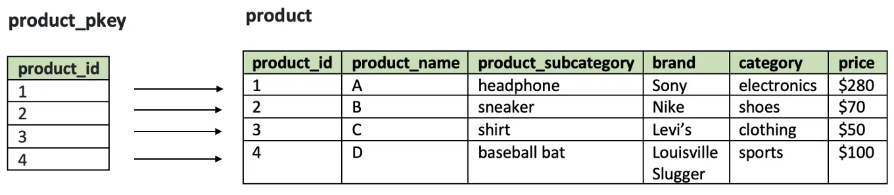

***Декластеризованные индексы*** - индексы, требующие явного определения.

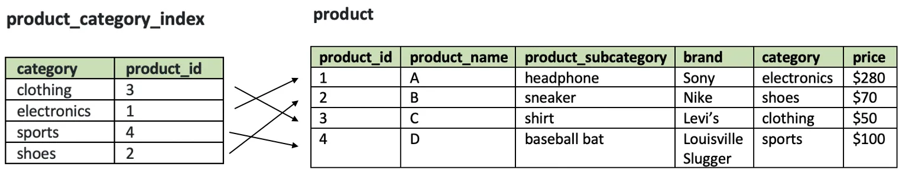

Подробнее о кластеризованных и некластеризованных индексах читать [тут](https://medium.com/nuances-of-programming/супер-сила-индексов-для-оптимизации-sql-запросов-df2549431bf8).  
Подробнее о типах индексов читать [тут](https://habr.com/ru/companies/ruvds/articles/724066/).

#### Типы индексов
- **B-Tree**  
  <ins>Balanced Tree</ins>, универсальный индекс, идеален для данных с высокой кардинальностью. <ins>Хранит уже отсортированные данные.<ins>
  ```sql
  CREATE INDEX idx_users_first_name ON users (first_name);
  ```
- **Bitmat-индекс**  
  Для столбцов с низкой кардинальностью, в идеале BOOLEAN, но подойдут любые данные с фиксированным количеством (например коды стран, статусы).  
  Не поддерживается PostgreSQL и MySQL напрямую, вместо него создаётся Btree, но при необходимости испольуется Bitmap Index Scan, если оптимизатор запроса решит что он будет эффективен для этого Btree индекса.  
- **Хеш-индекс**  
  Работает как хеш-таблица (массивы php). Из значения генерируется хеш, и указатель на позицию в бд ложится в бакет с этим хешем. возможны коллизии, но они разруливаются встроенным механизмом. Очень быстрый для операций поиска по точному совпадению
  ```sql
  CREATE INDEX idx_users_first_name_hash ON users USING HASH (first_name);
  ```
- **Триграммные индексы (GiST)**  
  Сложная древовидная структура. Для геометрических объектов, текста, массивов и других сложных типов данных
  ```sql
  CREATE INDEX idx_users_geoposition_gist ON users USING GiST (geoposition);
  ```
- **Полнотекстовый индекс (GIN)**  
  Для индексирования текстовых данных. Каждому слову присваивается токен, токены индексируются, поиск производится по токенам. может быть не очень эффективно для мультиязычных бд и не эффективно для не текстовых данных
  ```sql
  CREATE INDEX idx_users_article_gin ON users USING GIN (article);
  ```

> В запросе вида `WHERE row LIKE '%утюг%'` не будут использоваться индексы, т.к. оператор `LIKE` с шаблоном, начинающимся с символа `%`, не может эффективно использовать B-Tree индекс, который работает по принципу упорядоченного поиска. 
> Индексы будут использоваться только в кейсе `LIKE 'утюг%'`. Для кейсов с двойным шаблоном нужно использовать полнотекстовый индекс или реверсированный индекс.

#### Реверсированный индекс
    Реверсированный индекс — это техника оптимизации, которая используется для ускорения поиска строк с неизвестным началом строки (LIKE '%утюг'). Идея заключается в том, чтобы хранить строки в "перевернутом" виде (например 'гюту%') и создавать индекс на этом перевернутом представлении.

Как работает реверсированный индекс:
- **Создание перевернутого столбца**  
  Для каждой строки в таблице создается дополнительный столбец, который содержит ту же строку, но записанную в обратном порядке (Оригинальная строка: `утюг`, перевернутая строка: `гюту`)
- **Индексация перевернутого столбца**  
  На перевернутом столбце создается стандартный B-Tree индекс. Это позволяет эффективно выполнять поиск по префиксам перевернутых строк.
- **Выполнение запросов**
  При выполнении запроса с шаблоном, содержащим суффикс `LIKE '%утюг'`, шаблон также переворачивается, и поиск выполняется по перевернутому столбцу `SELECT * FROM products WHERE reversed_name LIKE REVERSE('утюг%');`

> Реверсированный индекс не помогает с поиском по произвольным подстрокам `LIKE '%утюг%'`, так как он работает только с суффиксами.

#### Частичный индекс (Partial Index)
    Частичный индекс — это индекс, который создается только для данных, удовлетворяющих определенному условию, например только для заказов со статусом 'active'

Вместо создания индекса на весь столбец status, можно создать частичный индекс только для строк со статусом 'active':

```sql
CREATE INDEX idx_orders_active ON orders (customer_id) WHERE status = 'active';
```

#### Покрывающий индекс (Covering Index)
    Покрывающий индекс — это индекс, который содержит все данные, необходимые для выполнения запроса, без необходимости обращаться к таблице. Это означает, что все столбцы, участвующие в запросе (как в условиях WHERE, так и в выборке SELECT), находятся в самом индексе.

Обычно, когда база данных использует индекс для поиска данных, она находит соответствующие строки в индексе, а затем выполняет "обратное чтение" (lookup) из таблицы, чтобы получить остальные данные, которые не входят в индекс. Если же индекс покрывает все необходимые столбцы, то дополнительное чтение таблицы не требуется, что значительно ускоряет выполнение запроса.

```sql
-- MySQL: Нужно создавать обычный составной индекс, содержащий дополнительные поля
-- PostgreSQL: Здесь добавляются столбцы name и email, но они не используются для поиска, а только для хранения данных.
CREATE INDEX idx_users_covering ON users (age) INCLUDE (name, email);
```

#### Составные индексы
    Составные индексы - индексы, состоящие из нескольких полей (до 32 в PostgreSQL и до 16 в MySQL независимо от движка) и используется для поиска по нескольким столбцам одновременно.

**Кардинальность**  
    Кардинальность — это мера уникальности значений в столбце. Чем больше уникальных значений в столбце, тем выше его кардинальность.

***Высокая кардинальность*** - у столбца `много` уникальных значений (идентификатор, телефон и др.).  
***Низкая кардинальность*** - у столбца `мало` уникальных значений (пол, страна, город и др.).

> Поиск по составному индексу с высокой кардинальностью в начале и низкой кардинальностью в конце (возраст_пол) будет быстрее, т.к. возраст более уникален и при поиске отсечётся больше значений.

Порядок полей в выборке (SELECT) не влияет на определение порядка полей в составном индексе. Например для запроса *SELECT * FROM users WHERE first_name = ? AND last_name = ?;* составной индекс всё так же будет основываться на кардинальности: *CREATE INDEX idx_users_last_name_first_name ON users (last_name, first_name);*. Однако, если first_name используется чаще в запросах, возможно, потребуется создать отдельный индекс для него.

> Когда поиск происходит по двум полям через <ins>OR</ins>, выгоднее использовать <ins>два индекса</ins>.  
> А вот для <ins>AND</ins> больше подходит составной, с порядком <ins>по кардинальности</ins>.   
> Однако если в запросе присутствует сортировка <ins>ORDER BY</ins>, то порядок столбцов в индексе должен <ins>учитывать требования сортировки</ins>. Например для *SELECT * FROM users WHERE first_name = ? AND last_name = ? ORDER BY first_name;* выгоднее индекс *CREATE INDEX idx_users_first_name_last_name ON users (first_name, last_name);*

### Временные таблицы
**CTE** - Временная таблица, предназначенная для использования в одном запросе. Часто используется для выполнения рекурсивного запроса. Удаление таблицы происходит сразу после выполнения запроса. Объявляется через ключевое слово WITH.  
**TMP** - Временная таблица для хранения результатов тяжелых запросов. Удаляется явно, либо после завершения соединения с БД.

### Как оптимизируются запросы в бд
- глянуть мониторинг (профайлер), вычленить долгие запросы 
- индексы
- лимиты
- материализованное/нематериализованное представление
- если операции чтения, то репликация. если записи, то очереди и шардирование
- если чтение, что ещё, как вариант, можно рассмотреть денормализацию, но могут возникать аномалии на больших данных

### Почитать 
- составной Primary key
- минусы джоинов на больших объёмах данных (лимиты памяти)
- есть запрос, который нельзя больше оптимизировать, формирующий результат больше минуты. предположим мы вводим кеш на 5 минут, но при инвалидации кеша несколько пользователей пытаются сформировать новый кеш, что создаёт большую нагрузку на бд. как это оптимизировать? (утилита, создающий новый кеш заранее, elastic, партицирование)
- в чём разница между primary key и unique key
- если рабить таблицу на партиции по одному параметру (id), а запрашивать по другому (gender), какие будут изменения в скорости выборки и от чего зависит?
- что такое php-fpm и fastCGI
- какие методики и инструменты вы используете для отладки и профилирования php-приложений. приведите пример улучшения достигнутого при помощи профилирования
- с какими асинхронными задачами приходилось сталкиваться (очереди, например отправка писем / swoole, но это скорее про многопоточность)
- какие преимущества разработки монолита вместо микросервисов
- что такое слоистая архитектура / чистая архитектура
- для чего больше подходит btree индекс 
- чем отличаются модели pub/sub (rabbit - очередь закидывает в consumer данные - consumer здесь subscriber) от pull/push (kafka - consumer сам приходит и читает/пуллит данные)
- для чего нужен roadrunner и swoole и почему вместо roadrunner просто не использовать op_cache/php-fpm
- чем отличается абстрактный класс от интерфейса (нельзя создать экземпляр абстрактного класса, возможна реализация методов, а интерфейс это просто описание методов, которые нужно реализовать. ну и можно имплементить множество интерфейсов, а отнаследоваться от абстрактного класса можно только раз)
- что такое сервис-локатор
- что такое фабрика
- что такое DI-контейнер
- что такое low coupling и high cohision и к какому принципу solid относится
- что такое абстрагирование (способ мышления когда выделяешь что-то важное, без конкретного описания. например вижу собаку и говорю что у неё есть: зубы, хвост, лапы и т.д.)
- почему все используют balanced tree индекс, а не хеш индекс, ведь хеш индекс проще индексируется и они оба хотят высокую кардинальность (в btree lfyные отсортированы)
- можно ли при помощи рекурсии написать бесконечный цикл. нельзя т.к. упадёт по памяти, но как сделать чтобы можно было?
- что такое stack trace в php
- в каких случаях правильнее нарушать принцип открытости-закрытости 
- таблицы типа bufer для записи в clickhouse
- у нас есть несколько команд и мы должны создавать инстансы этих команд по какому-то признаку или внешнему контексту. какой паттерн применить? (фабрики - читать про паттерны)
- нужно ли передавать $this через use в замыкание
- как к объекту обратиться как к массиву через $class['property'] при помощи магических методов
- какуие у бд бывают виды ключей и для чего нужен каждый из них
- в каких кейсах нужна денормализация
- сложности индексов как структур данных
- ArrayAccess
- Итераторы, генераторы и разница между ними
- как избежать sql-инъекций на уровне бд? (prepare statement for execution и валидация через check)
- назовите простые типы данных php
- что такое транзакция
- чем отличается at от copy в докере
- чем отличаются базы sql от nosql
- action based архитектура 

дополнительно
- ивенты бд
- вакуумизация
- оконные функции
- group by/having

### Масштабирование БД
**Вертикальное** - Наращивание ресурсов.  
**Горизонтальное** - Несколько нод.  

- **Шардирование** - *Горизонтальное масштабирование. При высокой нагрузке на запись (по сути единственный вариант масштабирования).*  
  Разделение `данных таблицы` между серверами (например данные с айди 1-5 на одном шарде, а 5-10 на другом). Единственный вариант масштабирования для операций записи, а также при большом объёме данных.  
  **Минусы**: Сложность реализации. Необходимо правильно выбрать ключ шардирования (shard key), чтобы данные были равномерно распределены. Перекрестные запросы (cross-shard queries) могут быть сложными и медленными. Управление миграцией данных между шардами при изменении структуры.  
- **Репликация** - *Горизонтальное масштабирование. При высокой нагрузке на чтение.*  
  Создание нескольких полностью идентичных `копий БД` на нескольких серверах (т.е. есть master бд, которая шлёт копии на slave бд, а чтение происходит из обеих бд). Идеальный вариант масштабирования при высокой нагрузке на чтение, повышения отказоустойчивости, или для получения географической распределённости. Реплик может быть много.  
  **Минусы**: может возникнуть задержка (replication lag) между обновлением данных на master и их появлением на slave, не решает проблемы нагрузки на запись.  
- **Партицирование** - *Вертикальное масштабирование. Для логов и других больших таблиц.*  
  Разделение `данных таблицы` на группы (например по годам или месяцам) в рамках одного сервера (т.е. данные могут храниться в разных файлах или на разных дисках, но они остаются в рамках одной таблицы одной бд). Помогает управлять таблицей когда когда она очень сильно разрастается. Идеальный вариант для масштабирования таблицы логов.  
  **Минусы**: Неправильный выбор ключа партиционирования может привести к неравномерному распределению данных. Работает только в рамках одного сервера.

### Нормализация и денормализация данных
    Нормализация - разделение данных одной таблицы на несколько, с целью избежать дублирования данных и упрощения их изменения.

Представьте, что у вас есть таблица в базе данных, в которой хранится информация о людях и их адресах. Вы можете иметь одну таблицу для хранения информации о людях и другую для их адресов.

    Денормализация - Объединение данных нескольких таблиц, с целью ускорения доступа к данным.

Допустим, у вас есть множество таблиц в базе данных, которые связаны между собой. Если вам часто приходится выполнять запросы, которые объединяют данные из нескольких таблиц, вы можете решить сохранить некоторые данные в одной таблице для более быстрого доступа, даже если это повторяет информацию из других таблиц.

### Нормальные формы БД  

    Нормальная форма базы данных — это набор правил и критериев, которым должна отвечать база данных.

Полностью нормализованная БД - это плохо спроектированная бд. Лучший вариант - это бд, спроектированная до той формы, которая не будет создавать аномалии для пользователей и будет иметь хорошую производительность.

> Обычная практика - нормализация до 3 формы (до 4 с many-to-many) т.к. далее происходит потеря производительности и становится неудобно работать с БД из-за количества таблиц и связей.

Полный порядок нормальных форм БД:  
- **Ненормализованная форма** или нулевая нормальная форма **(UNF)**  
  <details>
    <summary>Нулевая нормальная форма</summary>

    Перед приведением БД к нормальной форме, нужно привести её к табличному, отвечающему базовым принципам реляционной теории, виду.  
    Строки в таблицах не должны быть пронумерованы (порядок строк и столбцов не имеет значения).
    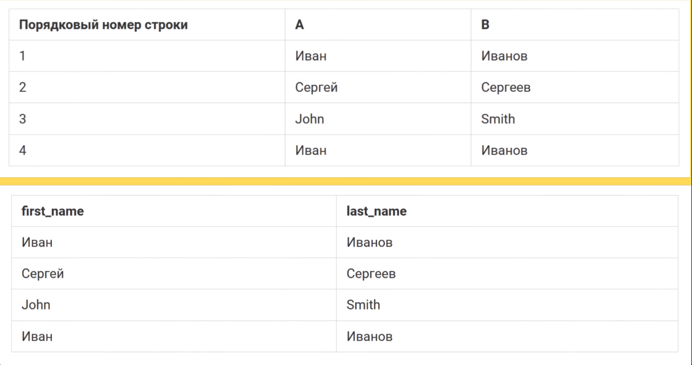
  </details>

- **Первая нормальная форма (1NF)**  
  <details>
    <summary>Первая нормальная форма</summary>

    Таблицы должны соответствовать реляционной модели и соблюдать реляционные принципы:
    - В таблице не должно быть дублирующих строк
    - В кадной ячейке таблицы хранится атомарное значение
    - В столбце хранятся данные одного типа
    - Отсутствуют массивы и списки в любом виде

    > Если таблица создана с соблюдением всех реляционных принципов, значит она уже находится в первой нормальной форме. Т.е. все реляционные БД находятся в первой нормальной форме.

    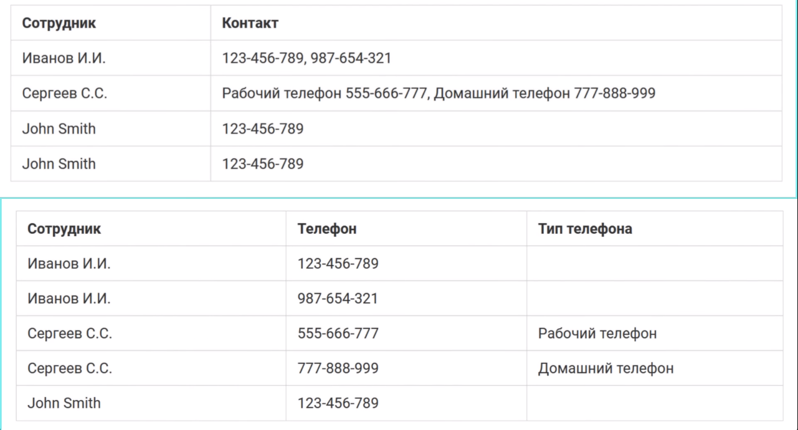
  </details>
  
- **Вторая нормальная форма (2NF)**  
  <details>
    <summary>Вторая нормальная форма</summary>

    - Таблица должна находиться в 1NF
    - Таблица должна иметь ключ
    - Все неключевые столбцы должны зависеть от полного ключа (в случае если ключ составной)

    > Таблица должна иметь ключ, по которому можно идентифицировать строку

    **Простой ключ**
    Здесь ключём записи будет табельный номер пользователя. Т.е. номер, который никогда не меняется.
    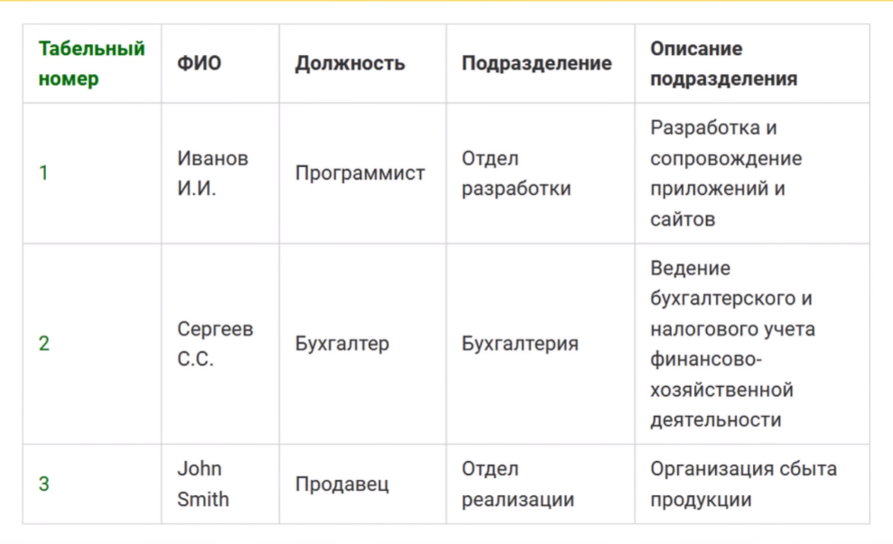

    **Составной ключ**  
    Предположим у нас есть таблица проектов, где один проект имеет несколько участников. Здесь ключом будет 2 строки: проект и участник. Т.е. зная только название проекта, нельзя определить должность участника (требования 2nf соблюдаются).
    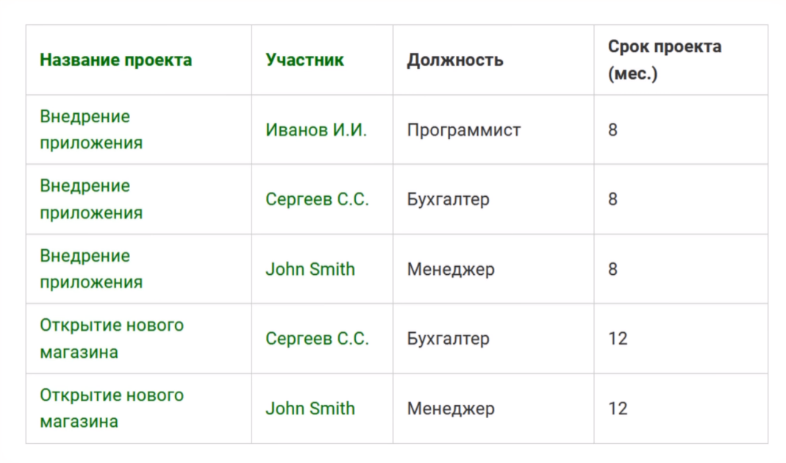
    Но зная только фио участника мы уже можем определить должность участника, а значит требование не соблюдается. Значит нужно произвести декомпозицию.
    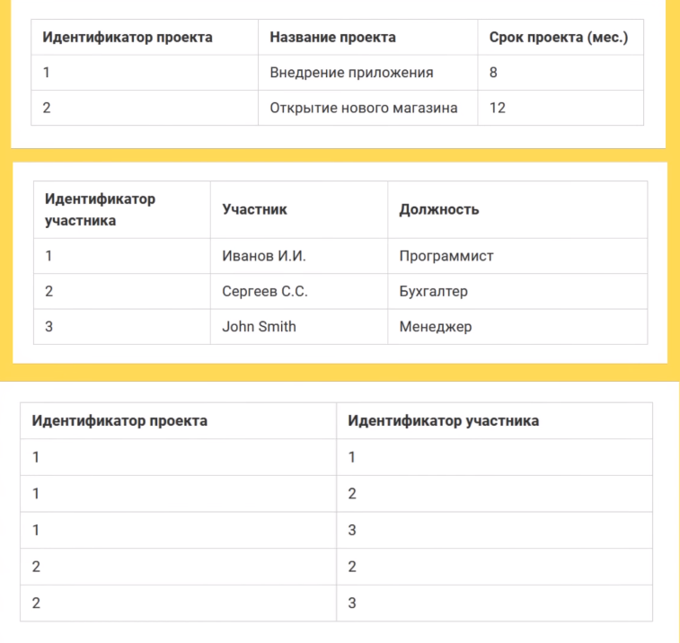
  </details>
- **Третья нормальная форма (3NF)**   
  <details>
    <summary>Третья нормальная форма</summary>

    В таблицах должна отсутствовать **транзитивная зависимость**.

        Транзитивная зависимость - это когда неключевые столбцы зависят от значений других неключевых столбцов.

    Неключевые столбцы не должны пытаться играть роль ключа в таблице.

    В качестве примера возьмём таблицу сотрудников из 2nf и заметим, что описание подразделения не должно храниться в таблице сотрудников, а значит здесь есть транзитивная зависимость. Проведём декомпозицию.
    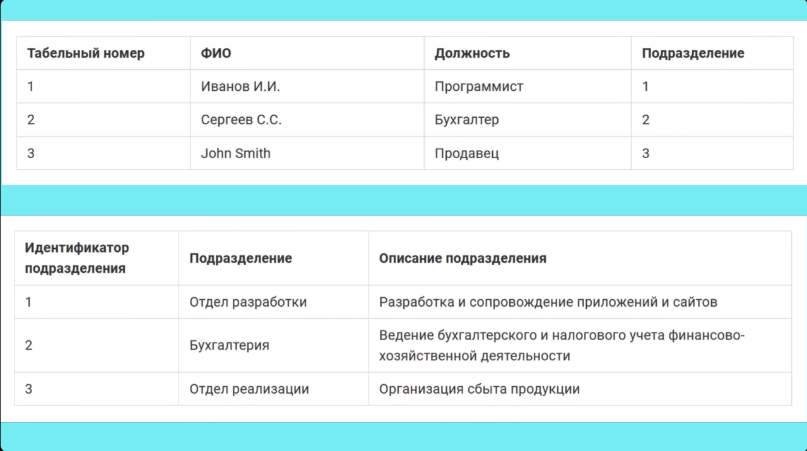
  </details>
- **Нормальная форма Бойса-Кодда (BCNF)**  
  <details>
    <summary>Нормальная форма Бойса-Кодда</summary>

    Требования BCNF актуальны только для таблиц с составным ключом

    - Таблица должна находиться в 3NF
    - Ключевые аттрибуты составного ключа не должны зависеть от неключевых аттрибутов

    > Часть составного первичного ключа не должна зависеть от неключевого столбца

    Рассмотрим пример, когда у нас есть таблица кураторов проектов. Здесь программисты не могут курировать проекты бухгалтерии и наоборот. Она соответствует 2NF, т.к. по направлению нельзя определить куртора и по проекту нельзя определить куратора. Тем не менее по куратору мы можем определить направление, а значит таблица не соответсвует BCNF.
    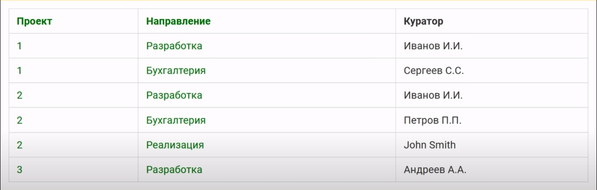
    Проведём декомпозицию
    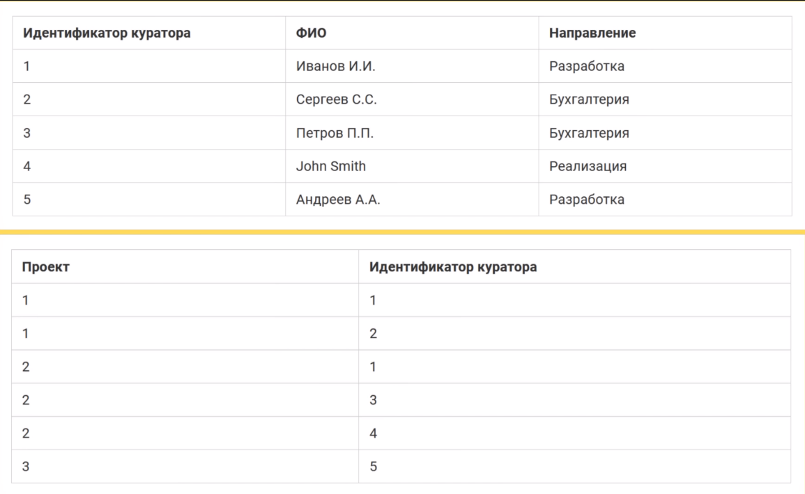
  </details>
- **Четвёртая нормальная форма (4NF)**  
  <details>
    <summary>Четвёртая нормальная форма</summary>

    В таблицах должны отсутствовать нетривиальные многозначные зависимости.

    Пример зависимости:  
    Есть таблица со столбцами А, В, С. При этом В и С никак не связаны между собой, но по отдельности они зависят от А, и для каждого значения А есть множество значений В и множество значений С.

    Получившиеся зависимости:  
    А --> B  
    A --> C

    > Таблицы не должны иметь многозначных зависимостей (как на скрине 2).

    У нас есть таблицы преподавателей, аудиторий и курсов. Каждый курс может проходить в меняющихся аудиториях у меняющихся преподавателей.
    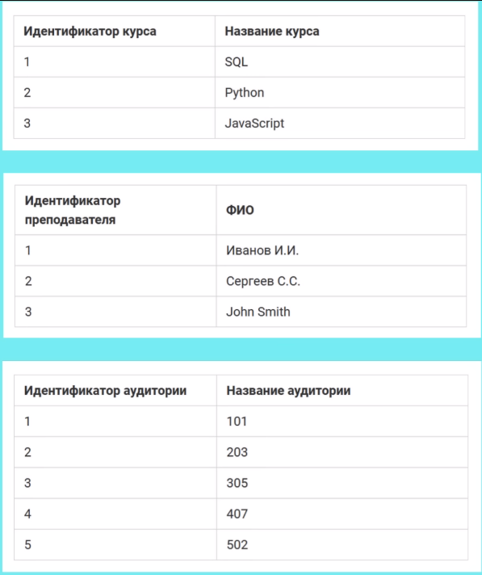
    Значит нам нужна таблица, хранящая все эти зависимости (пример без идентификаторов для наглядности). Однако если Иванов уволился, или для курса ещё не определена аудитория (а значит нужны null или default значения), или отменили курс, это приведёт к аномалиям в расписании.
    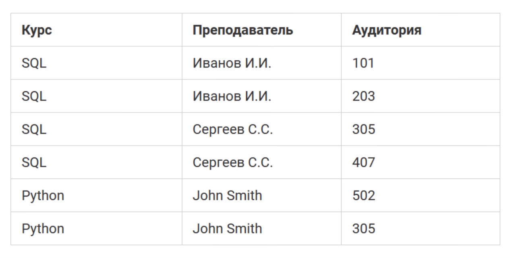
    Выделим ключевую таблицу, от которой будем строить зависимости и проведём декомпозцию
    
  </details>
- **Пятая нормальная форма (5NF)**  
  <details>
    <summary>Пятая нормальная форма</summary>

    Переменная отношения находится в 5NF (проекционно соединительной нормальной форме), когда каждая нетривиальная зависимость соединения в ней определяется потенциальным ключом (ключами) этого отношения.

    Есть таблицы, которые при декомпозиции на 2 таблицы могут потерять некоторые данные, но при декомпозиции на 3 таблицы потери данных можно избежать.

        Декомпозиция без потерь - процесс разбиения одной таблицы на несколько, при словии, что в случае соединения таблиц, которые были получены в результате декомпозиции (join), будет формироваться та же информация, что и в исходной таблице до декомпозиции.

    > Если спросят находится ли таблица в 5 нормальной форме, можно смело отвечать что неизвестно, т.к. всё зависит от требований предметной области XD

    Пример с описанной предметной областью:
    
    Декомпозируем таблицу  
    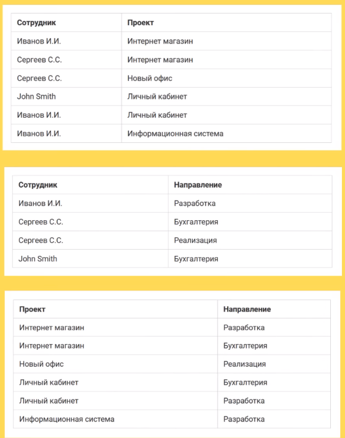
  </details>
- **Доменно-ключевая нормальная форма (DKNF)**  
  <details>
    <summary>Доменно-ключевая нормальная форма</summary>

    Каждое наложенное ограничение на таблицу должно являться логическим следствием **ограничений доменов** и **ограничений ключей**, которые накладываются на таблицу.

        Ограничение домена - ограничение, предписывающее использование для определённого атрибута значений только из некоторого заданного домена (набора значений).  

        Ограничение ключа - ограничение, утверждающее, что некоторый атрибут или комбинация атрибутов представляет собой потенциальный ключ.
  </details>
- **Шестая нормальная форма (6NF)**  
  <details>
    <summary>Шестая нормальная форма</summary>

    Была введена при работе с хронологическими БД.

        Хронологическая БД - база, которая может хранитьь не только текущие данные, но и исторические данные, т.е. данные, относящиеся к прошлым периодам времени.

    Таблица должна удовлетворять всем нетривиальным зависимостям соединения.

    > Таблица находится в 6NF, когда она неприводима, т.е. не может быть подвергнута дальнейшей декомпозиции без потерь.

    6NF вводит такое понятие как "декомпозиция до конца", т.е. максимально возможная декомпозиция таблиц.
  </details>

## Laravel

### Artisan
**Artisan** - это файл, находящийся в корне проекта. Он запускает приложение в консольном режиме и помогает взаимодействовать с ним не через http запросы, а через терминал.

### Жизненный цикл запроса
Подробнее тут: [https://mydev.fun/laravel/lifecycle](https://mydev.fun/laravel/lifecycle)

1. Все запросы попадают в *public/index.php*, где происходит автозагрузка composer-зависимостей фреймворка и пакетов из *vendor/autoload.php*
2. В том же *public/index.php* происходит получение экземпляра приложения из *bootstrap/app.php* (создание инстанса приложения) и инициализация сервис-контейнера.
3. Загрузка файлов ядра *Kernel.php* (HTTP или Console). Загружается обработка исключений, логгироание и т.д., а если ядро HTTP, то и некоторые миддлвары для всех или некоторых запросов, в т.ч. сервисные.
4. Загрузка сервис-провайдеров из *config/app.php* и другие компоненты фреймворка.
5. Роутинг и миддлвары
6. Выполнение логики в контроллерах и возврат ответа, а также выполнение post-middleware для преобразования ответа.

### Сервис-контейнеры и сервис-провайдеры (простыми словами)
**Сервис-контейнеры** помогают управлять зависимостями и компонентами вашего приложения, а **сервис-провайдеры** используются для регистрации этих компонентов в сервис-контейнере.

### Guard
    Гарды представляют собой механизм аутентификации (вход пользователя) в вашем приложении.

// TODO дополнить

### Gates / Policies (дополнить)
    Гейты представляют собой механизм авторизации (доступ по пермишшенам), который позволяет определять правила доступа к определенным действиям или ресурсам в вашем приложении.

Гейты предоставляют простой и элегантный способ проверки разрешения на выполнение определенных действий, основанный на заданных условиях.

Гейты работают в паре с политиками (Policies), которые определяют разрешения для различных моделей в вашем приложении. Политики определяют правила доступа для конкретных действий, таких как просмотр, создание, изменение и удаление, для каждой модели данных в вашем приложении. Гейты же используются для определения глобальных разрешений на основе пользовательских условий.

Пример определения гейта и его использования:

```php
// Определение гейта в AuthServiceProvider
Gate::define('update-post', function ($user, $post) {
    return $user->id === $post->user_id;
});

// Использование гейта в контроллере
public function update(Request $request, Post $post)
{
    if (Gate::allows('update-post', $post)) {
        // Пользователь имеет разрешение на обновление поста
        // Ваш код обновления поста
    } else {
        // Пользователь не имеет разрешения на обновление поста
        abort(403, 'Доступ запрещен.');
    }
}

```

### Троттлинг
***Троттлинг*** - это ограничение пропускной способности (Rate Limiter). Реализуется при помощи миддлвары throttle. Для каждого запроса генерируется уникальный fingerprint на базе ip, url и других факторов, который ложится в хранилище кеша.

## Полезные вопросы после собеседования
 - Пишете ли вы тесты?
 - Как происходят код-ревью? Это Кросс-ревью, или проверяет тимлид?
 - Есть ли на проекте БА, описывающие задачи, или нужно уточнять детали?
 - Какой вы видите скоуп работ для кандидата?

